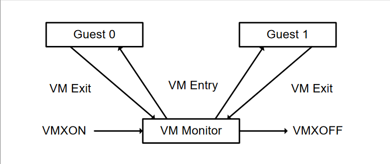

# Intel VT-x Hypervisor Development in Rust

This article will cover the development of a minimalistic Intel VT-x research hypervisor in Rust, code-named [SecretVisor](https://github.com/thesecretclub/SecretVisor), which can be found on Secret Club's GitHub. We will use the [x86 crate](https://crates.io/crates/x86) and [documentation](https://docs.rs/x86/latest/x86/), which help simplify the code.

The knowledge acquired to make this hypervisor was from reading blogs and code, notably the two excellent free hypervisor development series by [@daax_rynd](https://revers.engineering/7-days-to-virtualization-a-series-on-hypervisor-development/) and [@Intel80x86](https://rayanfam.com/). The motivation came shortly [@not_matthias](https://github.com/not-matthias/amd_hypervisor) released an AMD (SVM) Hypervisor in Rust, and the majority of the hypervisor was already developed before the legendary [@tandasat](https://github.com/tandasat/Hypervisor-101-in-Rust) released Hypervisor 101 in Rust.

## Virtual Machine Architecture

`Virtual Machine Monitor (VMM):` A VMM serves as a host and has complete command over the platform's processor(s) and other hardware. A VMM enables guest software to run directly on a logical processor by providing it with an abstraction of a virtual processor. A VMM can maintain granular control over I/O, interrupt handling, physical memory, and processor resources.

`Guest Software:` Any software that runs inside a virtual machine (VM) controlled by a virtual machine monitor (VMM) or hypervisor is referred to as guest software. Each virtual machine (VM) supports an operating system (OS) stack and application software as a guest software environment. Each virtual machine runs independently of the others and has a standard interface with the physical platform's processor(s), memory, storage, graphics, and I/O. The software stack performs as though it were on a platform without a VMM. So that the VMM may continue to have control over platform resources, software running in virtual machines must have fewer privileges.


## Introduction to Virtual Machine Extension (VMX) Operation

An operation that the Virtual Machine Monitor (VMM) does to enter or depart a virtual machine execution mode is referred to as a VMX operation. The host system's standard operating mode and the virtualized operating mode of the guest system executing within the VM are switched via the VMX procedure. The virtualization technology in the processor supports the low-level VMX operation, which enables the VMM to construct and manage virtual machines.

## Life Cycle of Virtual Machine Monitor (VMM) Software

The Virtual Machine Monitor (VMM) can enter and leave the execution mode of virtual machines (VMs) using low-level hardware operations called `VM ENTRY` and `VM EXIT`. Other low-level hardware operations, such as `VMXON` and `VMXOFF`, enable and disable the VMX operation, the processor's implementation of hardware virtualization that supports VMMs, respectively. In essence, `VMXON` and `VMXOFF` allow the VMM to construct and operate virtual machines, whereas `VM ENTRY` and `VM EXIT` enable the VMM to move between the host system and the guest system.



*Credits: Intel® 64 and IA-32 Architectures Software Developer Manual*


## Virtual-Machine Control Structure (VMCS)

A virtual machine's execution is managed and controlled by the Virtual Machine Monitor (VMM) via a virtual machine control structure (VMCS).
The virtual machine's state, the settings for the virtual processor, and the mapping between the virtual and physical resources are all contained in the VMCS.

The VMM employs a collection of low-level instructions to control the VMCS. The Virtual-Machine Control Structure Pointer (VMCS pointer), which enables the VMM to access the VMCS for a particular VM, can be read using `VMPTRST` and loaded using `VMPTRLD`. The VMM can alter the virtual machine's state or obtain details regarding its present state by using the commands `VMREAD` and `VMWRITE`, which are used to read and write values from and to the VMCS, respectively. When a virtual machine is terminated, or its state needs to be reset, `VMCLEAR` is used to clear the contents of the VMCS.

Each of the VMCSs assigned to a physical computer's logical processors corresponds to a particular virtual machine. As a result, the VMM can oversee and administer numerous virtual machines on a single physical device. In order to generate, monitor, and manage the execution of virtual machines on logical processors, the VMCS and related instructions give the VMM essential control and management capabilities.


## Discovering Support for Virtual Machine Extension (VMX)

When developing a hypervisor, it's crucial to determine whether Intel or AMD built the CPU because each manufacturer has a unique virtualization technology with unique capabilities and instructions. It is vital to identify the processor type and employ the proper approaches to use these technologies and guarantee that the hypervisor functions on various systems.

The `CPUID` instruction can be used to determine whether Virtual Machine Extension (VMX) / Intel Virtualization Technology is supported. The processor will reveal information about its features, including whether it supports VMX, when the `CPUID` instruction is run with the `EAX` register set to `1`. The `EAX`, `EBX`, `ECX`, and `EDX` registers store the CPUID data for the processor. If VMX is supported by the processor, bit `5` of `ECX` will be set to `1`. The processor does not support VMX if the bit is not set, making virtualization unavailable.


### Rust

We check whether Intel makes the CPU by examining the `CPUID` information using the Rust x86 crate. Specifically, we check the vendor information returned by the `CPUID` instruction to see if it equals `"GenuineIntel"`. If the vendor information indicates an Intel CPU, we return an `Ok` result; otherwise, we return an error indicating that the hypervisor does not support the CPU.

```rust
/// Check to see if CPU is Intel (“GenuineIntel”).
pub fn has_intel_cpu() -> Result<(), HypervisorError> {
    let cpuid = CpuId::new();
    if let Some(vi) = cpuid.get_vendor_info() {
        if vi.as_str() == "GenuineIntel" {
            return Ok(());
        }
    }
    Err(HypervisorError::CPUUnsupported)
}
```

### Rust

We check whether the processor supports Virtual Machine Extension (VMX) technology by checking if the bit `5` in the `ECX` register is set to `1` using the `CPUID` instruction. We use the Rust x86 crate to get the CPUID information and check whether the processor has VMX support by reading the feature information. If the processor supports VMX, we return an `Ok` result; otherwise, we return an error indicating that VMX is not supported.

```rust
/// Check processor supports for Virtual Machine Extension (VMX) technology - CPUID.1:ECX.VMX[bit 5] = 1 (Intel Manual: 24.6 Discovering Support for VMX)
pub fn has_vmx_support() -> Result<(), HypervisorError> {
    let cpuid = CpuId::new();
    if let Some(fi) = cpuid.get_feature_info() {
        if fi.has_vmx() {
            return Ok(());
        }
    }
    Err(HypervisorError::VMXUnsupported)
}
```

### Rust

We use a custom `HypervisorError` enum to handle errors, which was made using [thiserror-no-std](https://crates.io/crates/thiserror-no-std) crate.

```rust
use thiserror_no_std::Error;

#[derive(Error, Debug)]
pub enum HypervisorError {
    #[error("Intel CPU not found")]
    CPUUnsupported,
    
    #[error("VMX is not supported")]
    VMXUnsupported,
    
    #[error("VMX locked off in BIOS")]
    VMXBIOSLock,
    
    #[error("Failed allocate memory via PhysicalAllocator")]
    MemoryAllocationFailed(#[from] core::alloc::AllocError),
    
    #[error("Failed to convert from virtual address to physical address")]
    VirtualToPhysicalAddressFailed,
    
    #[error("Failed to execute VMXON")]
    VMXONFailed,
    
    #[error("Failed to execute VMXOFF")]
    VMXOFFFailed,
    
    #[error("Failed to execute VMCLEAR")]
    VMCLEARFailed,

    #[error("Failed to execute VMPTRLD")]
    VMPTRLDFailed,
    
    #[error("Failed to execute VMREAD")]
    VMREADFailed,
    
    #[error("Failed to execute VMWRITE")]
    VMWRITEFailed,
    
    #[error("Failed to execute VMLAUNCH")]
    VMLAUNCHFailed,

    #[error("Failed to execute VMRESUME")]
    VMRESUMEFailed,
    
    #[error("Failed to switch processor")]
    ProcessorSwitchFailed,
    
    #[error("Failed to access VCPU table")]
    VcpuIsNone,
}
```

## Enabling and Entering Virtual Machine Extension (VMX) Operation

The CPU must operate in a hardware virtualization mode to execute virtual machines, made possible by Virtual Machine Extensions (VMX). System software initially sets the `CR4.VMXE[bit 13]` to `1` to enable VMX. This bit is found in the control register `CR4`, which regulates the processor's multiple operating modes. The system software can execute the `VMXON` instruction to enter VMX operating mode once the VMX bit has been set.

Yet when `VMXON` is attempted to be executed with `CR4.VMXE = 0`, an invalid-opcode exception (`#UD`) is raised. Because VMX is not enabled, the CPU does not recognize the `VMXON` instruction, which leads to this exception. After the processor switches to VMX operation mode, the `CR4.VMXE` bit cannot be cleared. Because of this, system software must exit VMX operating mode with the `VMXOFF` instruction before `CR4.VMXE` may be cleared.

### Rust

We have a function called `enable_vmx_operation()` that enables virtual machine extensions (VMX). We do this by setting a specific bit (bit `13`) in the `CR4` control register to `1`. We first read the current value of `CR4` using the `controlregs::cr4()` function, then set the appropriate bit using the `set()` method of the `Cr4` struct, and finally, write the updated value back to `CR4` using the `controlregs::cr4_write()` function.

In addition to setting the `CR4` bit, we call the `set_lock_bit()` function, which sets a lock bit via the `IA32_FEATURE_CONTROL` register and logs a message indicating that the lock bit has been set. If everything goes well, we return a `Result` with an `Ok` value indicating success. If an error occurs, we return a `Result` with an `Err` value containing a `HypervisorError`.

```rust
/// Enables Virtual Machine Extensions - CR4.VMXE[bit 13] = 1 (Intel Manual: 24.7 Enabling and Entering VMX Operation)
pub fn enable_vmx_operation() -> Result<(), HypervisorError> {
    let mut cr4 = unsafe { controlregs::cr4() };
    cr4.set(controlregs::Cr4::CR4_ENABLE_VMX, true);
    unsafe { controlregs::cr4_write(cr4) };

    set_lock_bit()?;
    log::info!("[+] Lock bit set via IA32_FEATURE_CONTROL");

    Ok(())
}
```

The `IA32_FEATURE_CONTROL` MSR is a model-specific register that controls the processor's features, including VMX capability. This register is zeroed when a logical processor is reset. Bits `0` through `1` and `2` are crucial for `VMXON`. Whether it can be updated depends on the lock bit in the MSR. If the lock bit is not set, `VMXON` execution will fail, and the MSR cannot be modified until after a power-up reset. The lock bit, bit `1`, bit `2`, or both can be changed in the BIOS to deactivate VMX capability.

* `Bit 1` activates `VMXON` in SMX mode, providing a more secure setting. If this bit is not set, `VMXON` execution in SMX mode will encounter an error.

* `Bit 2` permits `VMXON` execution while SMX mode is not active. A general protection exception is triggered when this bit is attempted to be set on logical processors that cannot support VMX operation.

The `IA32_FEATURE_CONTROL` MSR and control bits in `CR4` need to be set in order to activate VMX. The lock bit, bit `1`, and bit `2` enable VMX. Once enabled, processors can enter the VMX operating mode and operate virtual machines using VMX instructions.

### Rust

We first check the current value of the `IA32_FEATURE_CONTROL` MSR register to see if the lock bit is already set. If it's not set, then we set the lock bit along with the `VMXON_OUTSIDE_SMX` bit and write the new value to the `IA32_FEATURE_CONTROL MSR` register. If the lock bit is already set, but the `VMXON_OUTSIDE_SMX` bit is not set, we then return an error indicating that the BIOS has locked the VMX feature.

```rust
/// Check if we need to set bits in IA32_FEATURE_CONTROL (Intel Manual: 24.7 Enabling and Entering VMX Operation)
fn set_lock_bit() -> Result<(), HypervisorError> {
    const VMX_LOCK_BIT: u64 = 1 << 0;
    const VMXON_OUTSIDE_SMX: u64 = 1 << 2;

    let ia32_feature_control = unsafe { rdmsr(msr::IA32_FEATURE_CONTROL) };

    if (ia32_feature_control & VMX_LOCK_BIT) == 0 {
        unsafe {
            msr::wrmsr(
                msr::IA32_FEATURE_CONTROL,
                VMXON_OUTSIDE_SMX | VMX_LOCK_BIT | ia32_feature_control,
            )
        };
    } else if (ia32_feature_control & VMXON_OUTSIDE_SMX) == 0 {
        return Err(HypervisorError::VMXBIOSLock);
    }

    Ok(())
}
```

## Restrictions on VMX Operation (Adjusting Control Registers)

In order to ensure that Virtual Machine Extension (VMX) Operation work as intended, specific bits in the Control Registers (`CR0` and `CR4`) must be set or cleared to particular values. The VMX operation will fail if any of these bits have an unsupported value when the system is in virtualization mode. A general protection exception will be thrown if one of these bits is ever attempted to be set to an unsupported value while the VMX operation is in progress. Software should consult the VMX capability MSRs `IA32_VMX_CR0_FIXED0`, `IA32_VMX_CR0_FIXED1`, `IA32_VMX_CR4_FIXED0`, and `IA32_VMX_CR4_FIXED1` to find out which bits in the `CR0` and `CR4` registers are fixed and how they should be set.

### Rust 

We have implemented functions that adjust the `CR0` and `CR4` control registers for virtualization. These functions aim to ensure that the mandatory bits in the Control Registers are set and cleared appropriately to support virtualization. To achieve this, we have defined two functions: `set_cr0_bits()` and `set_cr4_bits()`. The former sets the mandatory bits in `CR0` while clearing the mandatory `zero` bits, while the latter does the same for `CR4`.

To adjust `CR0` and `CR4`, we read the values stored in the `IA32_VMX_CR0_FIXED0`, `IA32_VMX_CR0_FIXED1`, `IA32_VMX_CR4_FIXED0`, and `IA32_VMX_CR4_FIXED1` Model-Specific Registers (MSRs) to determine which bits should be set and cleared. We then use the `from_bits_truncate()` function to ensure that the bit values fit within the `Cr0` and `Cr4` types, set the mandatory bits using the or bitwise operator, and clear the mandatory `zero` bits using the and bitwise operator. Finally, we write the resulting value back to the `CR0` or `CR4` register using the `cr0_write()` or `cr4_write()` functions.

We have also defined a higher-level function `adjust_control_registers()` that calls both `set_cr0_bits()` and `set_cr4_bits()`. This function sets and clears the mandatory bits in both `CR0` and `CR4` and logs a message indicating that the bits have been set/cleared.

```rust
/// Adjust set and clear the mandatory bits in CR0 and CR4
pub fn adjust_control_registers() {
    set_cr0_bits();
    log::info!("[+] Mandatory bits in CR0 set/cleared");

    set_cr4_bits();
    log::info!("[+] Mandatory bits in CR4 set/cleared");
}

/// Set the mandatory bits in CR0 and clear bits that are mandatory zero (Intel Manual: 24.8 Restrictions on VMX Operation)
fn set_cr0_bits() {
    let ia32_vmx_cr0_fixed0 = unsafe { msr::rdmsr(msr::IA32_VMX_CR0_FIXED0) };
    let ia32_vmx_cr0_fixed1 = unsafe { msr::rdmsr(msr::IA32_VMX_CR0_FIXED1) };

    let mut cr0 = unsafe { controlregs::cr0() };

    cr0 |= controlregs::Cr0::from_bits_truncate(ia32_vmx_cr0_fixed0 as usize);
    cr0 &= controlregs::Cr0::from_bits_truncate(ia32_vmx_cr0_fixed1 as usize);

    unsafe { controlregs::cr0_write(cr0) };
}

/// Set the mandatory bits in CR4 and clear bits that are mandatory zero (Intel Manual: 24.8 Restrictions on VMX Operation)
fn set_cr4_bits() {
    let ia32_vmx_cr4_fixed0 = unsafe { msr::rdmsr(msr::IA32_VMX_CR4_FIXED0) };
    let ia32_vmx_cr4_fixed1 = unsafe { msr::rdmsr(msr::IA32_VMX_CR4_FIXED1) };

    let mut cr4 = unsafe { controlregs::cr4() };

    cr4 |= controlregs::Cr4::from_bits_truncate(ia32_vmx_cr4_fixed0 as usize);
    cr4 &= controlregs::Cr4::from_bits_truncate(ia32_vmx_cr4_fixed1 as usize);

    unsafe { controlregs::cr4_write(cr4) };
}
```

## VMXON Region

Software must allocate a memory region called the `VMXON Region`, which will be used by the logical processor for VMX operation, before allowing virtual machine extensions (VMX) activity. The operand for the `VMXON` instruction is the physical address of this area. 

The `VMXON` pointer must adhere to certain specifications, such as being 4-KByte aligned and not exceeding the processor's physical address width. Software must use a different region for each logical processor and write the VMCS revision identification (VMCS ID) to the `VMXON` region before `VMXON` is executed. Unpredictable behaviour may emerge from accessing or altering the `VMXON` region of a logical processor between the execution of `VMXON` and `VMXOFF`.

### Rust

Fortunately for us, [@not-matthias](https://twitter.com/not_matthias) already has a [kernel-alloc](https://crates.io/crates/kernel-alloc) crate in Rust ready for community use.

The `PhysicalAllocator` is a custom allocator that allocates physical memory in Windows kernel mode. When you allocate memory using this allocator, it calls the [`MmAllocateContiguousMemorySpecifyCacheNode`](https://learn.microsoft.com/en-us/windows-hardware/drivers/ddi/wdm/nf-wdm-mmallocatecontiguousmemoryspecifycachenode) function to allocate contiguous physical memory. If the allocation is successful, it returns a pointer to the allocated memory. If it fails, it returns an `AllocError`. When you deallocate memory using this allocator, it calls the [`MmFreeContiguousMemory`](https://learn.microsoft.com/en-us/windows-hardware/drivers/ddi/wdm/nf-wdm-mmfreecontiguousmemory) function to free the memory that was previously allocated. This allocator can be used with Rust's `GlobalAlloc` trait to provide a custom global allocator for Rust's heap-allocated data types like `String`, `Vec`, and `Box`. 

If you want to find out more about it, please refer to the [alloc::GlobalAllocator](https://doc.rust-lang.org/std/alloc/trait.GlobalAlloc.html) or [alloc::Allocator](https://doc.rust-lang.org/std/alloc/trait.Allocator.html) and the Rust book for [global_allocator](https://doc.rust-lang.org/1.26.2/unstable-book/language-features/global-allocator.html) or [allocator_api.](https://doc.rust-lang.org/1.26.2/unstable-book/library-features/allocator-api.html)


```rust
/// The physical kernel allocator structure.
pub struct PhysicalAllocator;

unsafe impl Allocator for PhysicalAllocator {
    fn allocate(&self, layout: Layout) -> Result<NonNull<[u8]>, AllocError> {
        let mut boundary: PHYSICAL_ADDRESS = unsafe { core::mem::zeroed() };
        let mut lowest: PHYSICAL_ADDRESS = unsafe { core::mem::zeroed() };
        let mut highest: PHYSICAL_ADDRESS = unsafe { core::mem::zeroed() };

        unsafe { *(boundary.QuadPart_mut()) = 0 };
        unsafe { *(lowest.QuadPart_mut()) = 0 };
        unsafe { *(highest.QuadPart_mut()) = -1 };

        let memory = unsafe {
            MmAllocateContiguousMemorySpecifyCacheNode(
                layout.size(),
                lowest,
                highest,
                boundary,
                MmCached,
                MM_ANY_NODE_OK,
            )
        } as *mut u8;
        if memory.is_null() {
            Err(AllocError)
        } else {
            let slice = unsafe { core::slice::from_raw_parts_mut(memory, layout.size()) };
            Ok(unsafe { NonNull::new_unchecked(slice) })
        }
    }

    unsafe fn deallocate(&self, ptr: NonNull<u8>, _layout: Layout) {
        MmFreeContiguousMemory(ptr.cast().as_ptr());
    }
}
```

* Credits: https://github.com/not-matthias/kernel-alloc-rs/


We are defining a struct called `VmxonRegion`, which represents a `VMXON Region` in memory. This region must be aligned to the page size of `4096` bytes (or `0x1000` in hexadecimal). The `VmxonRegion` structure contains two fields: `revision_id` and `data`. The `revision_id` is a `32-bit` unsigned integer representing the version of the VMX capabilities supported by the processor, and it takes up `4` bytes of the memory region. The data field is an array of `4092` bytes that contains the rest of the `VMXON Region`. By using the `repr(C, align(4096))` attribute, we ensure that the `VmxonRegion` type is laid out exactly as specified, with `4096` bytes of memory allocated for each instance of this type. This ensures that the `VMXON Region` is aligned correctly in memory and can be used by the processor without any issues.

```rust
pub const PAGE_SIZE: usize = 0x1000;

#[repr(C, align(4096))]
pub struct VmxonRegion {
    pub revision_id: u32,
    pub data: [u8; PAGE_SIZE - 4],
}
```

We define a function `get_vmcs_revision_id` that returns the Virtual Machine Control Structure (VMCS) revision ID. To get this revision ID, we read a Model Specific Register (MSR) using the `rdmsr` function, passing it the MSR identifier `IA32_VMX_BASIC`. We cast the returned value to a `32-bit` unsigned integer and then bitwise `AND` it with `0x7FFF_FFFF` to clear the high bit, which is reserved. The resulting value is the VMCS revision ID, which we return.

```rust
/// Get the Virtual Machine Control Structure revision identifier (VMCS revision ID) (Intel Manual: 25.11.5 VMXON Region)
pub fn get_vmcs_revision_id() -> u32 {
    unsafe { (msr::rdmsr(msr::IA32_VMX_BASIC) as u32) & 0x7FFF_FFFF }
}
```


To convert a virtual address to a physical address, we can use the `MmGetVirtualForPhysical` undocumented function. Luckily for us we can reuse the code written by [@not-matthias](https://twitter.com/not_matthias) in this [amd_hypervisor](https://github.com/not-matthias/amd_hypervisor/blob/main/hypervisor/src/utils/addresses.rs) since there is no crate for it currently.

We have two functions here. The first function, `physical_address` takes a pointer to a `u64` and converts it to a physical address of type `PAddr`. This function is used to convert virtual addresses to physical addresses. The second function `va_from_pa` takes a physical address and converts it to a virtual address. This is achieved using the Windows kernel undocumented function `MmGetVirtualForPhysical`.

```rust
pub fn physical_address(ptr: *const u64) -> PAddr {
    PhysicalAddress::from_va(ptr as u64).0
}

fn va_from_pa(pa: u64) -> u64 {
    let mut physical_address: PHYSICAL_ADDRESS = unsafe { core::mem::zeroed() };
    unsafe { *(physical_address.QuadPart_mut()) = pa as i64 };

    unsafe { MmGetVirtualForPhysical(physical_address) as u64 }
}
```

* Credits: https://github.com/not-matthias/amd_hypervisor/blob/main/hypervisor/src/utils/addresses.rs


The `VcpuData` struct represents data associated with a virtual CPU in a hypervisor, and it contains a field called `vmxon_region`, which is a zero-initialized naturally aligned `4-KByte` region of memory, as well as a field called `vmxon_region_physical_address` which is its physical address. The `new()` function initializes the `VcpuData` struct and allocates the `VMXON Region` in memory using a `PhysicalAllocator`. The `init_vmxon_region()` function initializes the `VMXON Region` with the VMCS revision ID, enables VMX operation by calling `vmxon()`, and returns an error if the virtual to physical address translation fails.

```rust
pub struct VcpuData {
    /// The virtual and physical address of the Vmxon naturally aligned 4-KByte region of memory
    pub vmxon_region: Box<VmxonRegion, PhysicalAllocator>,
    pub vmxon_region_physical_address: u64,
}

impl VcpuData {
    pub fn new() -> Result<Box<Self>, HypervisorError> {
        let instance = Self {
            vmxon_region: unsafe { Box::try_new_zeroed_in(PhysicalAllocator)?.assume_init() },
            vmxon_region_physical_address: 0,
        };

        let mut instance = Box::new(instance);
                
        log::info!("[+] init_vmxon_region");
        instance.init_vmxon_region()?;
    }

    /// Allocate a naturally aligned 4-KByte VMXON region of memory to enable VMX operation (Intel Manual: 25.11.5 VMXON Region)
    pub fn init_vmxon_region(&mut self) -> Result<(), HypervisorError> {
        self.vmxon_region_physical_address = physical_address(self.vmxon_region.as_ref() as *const _ as _).as_u64();

        if self.vmxon_region_physical_address == 0 {
            return Err(HypervisorError::VirtualToPhysicalAddressFailed);
        }

        log::info!("[+] VMXON Region Virtual Address: {:p}", self.vmxon_region);
        log::info!("[+] VMXON Region Physical Addresss: 0x{:x}", self.vmxon_region_physical_address);

        self.vmxon_region.revision_id = support::get_vmcs_revision_id();
        self.vmxon_region.as_mut().revision_id.set_bit(31, false);

        support::vmxon(self.vmxon_region_physical_address)?;
        log::info!("[+] VMXON successful!");

        Ok(())
    }
}
```

The `vmxon()` function is just a wrapper around the x86 `vmxon()` function, which calls `vmxon <addr>` in assembly. However, it is not necessary to create wrappers, but it helps with error handling.

```rust
/// Enable VMX operation.
pub fn vmxon(vmxon_pa: u64) -> Result<(), HypervisorError> {
    match unsafe { x86::bits64::vmx::vmxon(vmxon_pa) } {
        Ok(_) => Ok(()),
        Err(_) => Err(HypervisorError::VMXONFailed),
    }
}
```

Overall, the above initializes a memory region to enable VMX operation for a virtual CPU in a hypervisor. However, we want to do this for every logical/virtual CPU.

## Processors, Cores and Logical/Virtual Processors (VCPUs)

`Processor:` The primary part of a computer that conducts mathematical, logical, input/output (I/O), and control activities is a processor, sometimes known as a central processing unit (CPU). It is in charge of carrying out commands and controlling the data flow inside a computer system.

`Cores:` A core is a physical processing unit that can carry out instructions within a CPU. In order to work in parallel with other cores, each core typically includes its arithmetic logic unit (ALU), register set, and cache.

`Logical Processor:` A processing unit within a CPU that can carry out a single thread of instructions is referred to as a logical processor, also known as a virtual processor. Depending on the particular processor design, each physical core in current CPUs can house several logical processors.

Say we have four physical cores in our processor; this translates to four separate processing units in our CPU. Hyper-threading technology allows for the simultaneous execution of two threads on each core. As a result, there are eight logical processors, which the operating system interprets as eight different CPUs.

General purpose registers, MSR registers, VMCSs, and `VMXON Regions` are among the registers to which each logical processor has access. We must ensure that a Virtual Machine Monitor (VMM) is set up to use all logical processors. This will enable us to make the most of our CPU's capabilities and deliver the best performance for our virtualized workloads.


### Rust

We have a struct called `Vcpu` that represents a virtual CPU. It has two fields: `index`, which is an integer that represents the index of the processor, and `data`, which is an [`OnceCell`](https://docs.rs/once_cell/latest/once_cell/) that holds a boxed `VcpuData` instance. The `new()` function takes an `index` as an argument and creates a new `Vcpu` instance with that index and an uninitialized data field.

The `virtualize_cpu` function is responsible for initializing the virtual CPU for virtualization. It first enables the Virtual Machine Extensions (VMX), `adjusts control registers`, and then initializes the `VcpuData` structure by calling `get_or_try_init` on the `data` field. The `get_or_try_init` function initializes the `data` field if it has not been initialized before or returns the existing value if it has been initialized.

The `devirtualize_cpu()` is used to devirtualize the CPU using the `vmxoff` instruction. This instruction is used to disable virtualization and return control to the host operating system. The function returns a `Result` indicating whether the operation was successful or not and any relevant error information. The `id()` returns the index of the current virtual processor, which is helpful in multi-processor systems where we need to identify which processor is executing the code.

```rust
pub struct Vcpu {
    /// The index of the processor.
    index: u32,
    
    data: OnceCell<Box<VcpuData>>,
}

impl Vcpu {
    pub fn new(index: u32) -> Result<Self, HypervisorError> {
        log::trace!("Creating processor {}", index);

        Ok (Self {
            index,
            data: OnceCell::new(),
        })
    }

    pub fn virtualize_cpu(&self) -> Result<(), HypervisorError> {
        log::info!("[+] Enabling Virtual Machine Extensions (VMX)");
        support::enable_vmx_operation()?;

        log::info!("[+] Adjusting Control Registers");
        support::adjust_control_registers();

        log::info!("[+] Initializing VcpuData");        
 
        let _vcpu_data = &self.data.get_or_try_init(|| VcpuData::new())?;
    }

    /// Devirtualize the CPU using vmxoff
    pub fn devirtualize_cpu(&self) -> Result<(), HypervisorError> {
        support::vmxoff()?;
        Ok(())
    }

    /// Gets the index of the current logical/virtual processor
    pub fn id(&self) -> u32 {
        self.index
    }
}
```

The `vmxoff()` function is just a wrapper around the x86 `vmxoff()` function, which calls `vmxoff` in assembly.

```rust
/// Disable VMX operation.
pub fn vmxoff() -> Result<(), HypervisorError> {
    match unsafe { x86::bits64::vmx::vmxoff() } {
        Ok(_) => Ok(()),
        Err(_) => Err(HypervisorError::VMXOFFFailed),
    }
}
```

Once again, we can reuse the code written by [@not-matthias](https://twitter.com/not_matthias) in this [amd_hypervisor](https://github.com/not-matthias/amd_hypervisor/blob/main/hypervisor/src/utils/processor.rs) since there is no crate for it currently. The module provides utilities for managing processor affinity, which is the ability to control which processor(s) a thread can execute. 

The `processor_count()` function returns the number of processors available on the system using the Windows kernel function [`KeQueryActiveProcessorCountEx`](https://learn.microsoft.com/en-us/windows-hardware/drivers/ddi/ntddk/nf-ntddk-kequeryactiveprocessorcountex)


The `current_processor_index()` function returns the index of the processor currently executing the calling thread using the Windows kernel function [`KeGetCurrentProcessorNumberEx`](https://learn.microsoft.com/en-us/windows-hardware/drivers/ddi/ntddk/nf-ntddk-kegetcurrentprocessornumberex)


The `processor_number_from_index()` function takes an `index` and returns the corresponding `PROCESSOR_NUMBER` structure, which identifies the processor's group and number within that group using the Windows kernel function [`KeGetProcessorNumberFromIndex`](https://learn.microsoft.com/en-us/windows-hardware/drivers/ddi/ntifs/nf-ntifs-kegetprocessornumberfromindex). If the index is out of range or if there is an error in the system call, the function returns `None`.

```rust
pub fn processor_count() -> u32 {
    unsafe { KeQueryActiveProcessorCountEx(ALL_PROCESSOR_GROUPS) }
}

pub fn current_processor_index() -> u32 {
    unsafe { KeGetCurrentProcessorNumberEx(core::ptr::null_mut()) }
}

/// Returns the processor number for the specified index.
fn processor_number_from_index(index: u32) -> Option<PROCESSOR_NUMBER> {
    let mut processor_number = MaybeUninit::uninit();

    let status = unsafe { KeGetProcessorNumberFromIndex(index, processor_number.as_mut_ptr()) };
    if NT_SUCCESS(status) {
        Some(unsafe { processor_number.assume_init() })
    } else {
        None
    }
}
```

The `ProcessorExecutor` struct temporarily switches execution to a specified processor until it is dropped. When an instance of `ProcessorExecutor` is created with a valid processor `index`, the `switch_to_processor()` function sets the affinity of the calling thread to the specified processor and yields execution to another thread using the Windows kernel function [`KeSetSystemGroupAffinityThread`](https://learn.microsoft.com/en-us/windows-hardware/drivers/ddi/wdm/nf-wdm-kesetsystemgroupaffinitythread). If there is an error setting the affinity or yielding execution, the function returns `None`. When the `ProcessorExecutor` instance is dropped, the original processor affinity is restored using the Windows kernel function [`KeRevertToUserGroupAffinityThread`](https://learn.microsoft.com/en-us/windows-hardware/drivers/ddi/wdm/nf-wdm-kereverttousergroupaffinitythread).

```rust
/// Switches execution to a specific processor until dropped.
pub struct ProcessorExecutor {
    old_affinity: MaybeUninit<GROUP_AFFINITY>,
}

impl ProcessorExecutor {
    pub fn switch_to_processor(i: u32) -> Option<Self> {
        if i > processor_count() {
            log::error!("Invalid processor index: {}", i);
            return None;
        }

        let processor_number = processor_number_from_index(i)?;

        let mut old_affinity = MaybeUninit::uninit();
        let mut affinity: GROUP_AFFINITY = unsafe { core::mem::zeroed() };

        affinity.Group = processor_number.Group;
        affinity.Mask = 1 << processor_number.Number;
        affinity.Reserved[0] = 0;
        affinity.Reserved[1] = 0;
        affinity.Reserved[2] = 0;

        log::trace!("Switching execution to processor {}", i);
        unsafe { KeSetSystemGroupAffinityThread(&mut affinity, old_affinity.as_mut_ptr()) };

        log::trace!("Yielding execution");
        if !NT_SUCCESS(unsafe { ZwYieldExecution() }) {
            return None;
        }

        Some(Self { old_affinity })
    }
}

impl Drop for ProcessorExecutor {
    fn drop(&mut self) {
        log::trace!("Switching execution back to previous processor");
        unsafe {
            KeRevertToUserGroupAffinityThread(self.old_affinity.as_mut_ptr());
        }
    }
}
```

* Credits: https://github.com/not-matthias/amd_hypervisor/blob/main/hypervisor/src/utils/processor.rs

We have a `Hypervisor` struct and a `HypervisorBuilder` struct for virtualization. The `HypervisorBuilder` struct has a `build()` function that creates a new `Hypervisor` instance and returns it as a `Result`. The `build()` function checks whether the CPU is an Intel processor and whether it supports the Virtual Machine Extension (VMX) technology. If the CPU and VMX are supported, the function creates and populates a vector (`Vec`) of virtual CPUs (`Vcpu`), one per available processor, and initializes a new `Hypervisor` instance with the vector of virtual CPUs (`Vcpu`).

The `Hypervisor` struct has three methods:

1. The `builder()` function returns a new `HypervisorBuilder` instance.

2. The `virtualize()` function virtualizes all of the available processors by calling `ProcessorExecutor::switch_to_processor()` for each processor and then calling the `virtualize_cpu()` method on each `Vcpu` instance in the `"processors"` vector.

3. The `devirtualize()` function devirtualizes all of the available processors by calling `ProcessorExecutor::switch_to_processor()` for each processor and then calling the `devirtualize_cpu()` method on each `Vcpu` object in the `"processors"` vector.

The `virtualize()` and `devirtualize()` functions use the `ProcessorExecutor` struct to switch execution to each processor temporarily and then switch back after the virtualization or devirtualization operation is complete.

Overall, this module provides a way to build a `Hypervisor` instance with support for virtualizing all available processors and provides methods for virtualizing and devirtualizing the processors using the `Vcpu` struct and the `ProcessorExecutor` struct.


```rust
#[derive(Default)]
pub struct HypervisorBuilder;

impl HypervisorBuilder {
    pub fn build(self) -> Result<Hypervisor, HypervisorError> {
        //
        // 1) Intel Manual: 24.6 Discover Support for Virtual Machine Extension (VMX)
        //
        support::has_intel_cpu()?;
        log::info!("[+] CPU is Intel");
    
        support::has_vmx_support()?;
        log::info!("[+] Virtual Machine Extension (VMX) technology is supported");

        let mut processors: Vec<Vcpu> = Vec::new();
        
        for i in 0..processor_count() {
            processors.push(Vcpu::new(i)?);
        }
        log::info!("[+] Found {} processors", processors.len());

        Ok(Hypervisor { processors })
    }
}

pub struct Hypervisor {
    processors: Vec<Vcpu>,
}

impl Hypervisor {
    
    pub fn builder() -> HypervisorBuilder {
        HypervisorBuilder::default()
    }

    pub fn virtualize(&mut self) -> Result<(), HypervisorError> {
        log::info!("[+] Virtualizing processors");

        for processor in self.processors.iter_mut() {
            
            let Some(executor) = ProcessorExecutor::switch_to_processor(processor.id()) else {
                return Err(HypervisorError::ProcessorSwitchFailed);
            };

            processor.virtualize_cpu()?;
                
            core::mem::drop(executor);
        }
        Ok(())
    }

    pub fn devirtualize(&mut self) -> Result<(), HypervisorError> {
        log::info!("[+] Devirtualizing processors");

        for processor in self.processors.iter_mut() {
            
            let Some(executor) = ProcessorExecutor::switch_to_processor(processor.id()) else {
                return Err(HypervisorError::ProcessorSwitchFailed);
            };

            processor.devirtualize_cpu()?;
                
            core::mem::drop(executor);
        }

        Ok(())
    }
}
```

This follows a similar neat structure to the [amd_hypervisor](https://github.com/not-matthias/amd_hypervisor/blob/main/hypervisor/src/svm/mod.rs) made by [@not-matthias](https://twitter.com/not_matthias), which will help integrate the open-source projects if required.

* Credits: https://github.com/not-matthias/amd_hypervisor/blob/main/hypervisor/src/svm/mod.rs


We create a Windows kernel driver in Rust. When loaded, the `driver_entry` function is called automatically, and we initialize a logger and set the driver unload function to `driver_unload`. We then attempt to virtualize the processor by calling `virtualize().is_none()`. If the virtualization process fails, we return `STATUS_UNSUCCESSFUL`, and if it succeeds, we return `STATUS_SUCCESS`.

The `virtualize()` function is responsible for virtualizing the processor using the `hypervisor` module. To do this, we create a new hypervisor using `Hypervisor::builder()` and attempt to build it using `hv.build()`. If the build process fails, we log an error message and return `None`. If the build process succeeds, we attempt to virtualize the processor using `hypervisor.virtualize()`. If the virtualization process succeeds, we log a success message, and if it fails, we log an error message and return `None`. If the virtualization process succeeds, we save the hypervisor in a static mutable variable called `HYPERVISOR` and return `Some(())`.

When our driver is unloaded, the `driver_unload` function is called automatically, which devirtualizes the processor using the `hypervisor` module. If the devirtualization process succeeds, we log a success message, and if it fails, we log the error message.

```rust
static mut HYPERVISOR: Option<Hypervisor> = None;

#[no_mangle]
pub extern "system" fn driver_entry(driver: &mut DRIVER_OBJECT, _: &UNICODE_STRING) -> NTSTATUS {
    KernelLogger::init(LevelFilter::Info).expect("Failed to initialize logger");
    log::info!("Driver Entry called");

    driver.DriverUnload = Some(driver_unload);


    if virtualize().is_none() {
        log::error!("Failed to virtualize processors");
        return STATUS_UNSUCCESSFUL;
    }

    STATUS_SUCCESS
}


pub extern "system" fn driver_unload(_driver: &mut DRIVER_OBJECT) {
    log::info!("Driver unloaded successfully!");
    
    if let Some(mut hypervisor) = unsafe { HYPERVISOR.take() } {
        match hypervisor.devirtualize() {
            Ok(_) => log::info!("[+] Devirtualized successfully!"),
            Err(err) => log::error!("[-] Failed to dervirtualize {}", err),
        }
    }
}

fn virtualize() -> Option<()> {

    let hv = Hypervisor::builder();

    let Ok(mut hypervisor) = hv.build() else {
        log::error!("[-] Failed to build hypervisor");
        return None;
    };

    match hypervisor.virtualize() {
        Ok(_) => log::info!("[+] VMM initialized"),
        Err(err) =>  {
            log::error!("[-] VMM initialization failed: {}", err);
            return None;
        }
    }

    unsafe { HYPERVISOR = Some(hypervisor) }

    Some(())
}
```

We can now test our code by creating a service and starting it to load our Windows kernel driver.

```
sc.exe create SecretVisor type= kernel binPath= C:\Windows\System32\drivers\SecretVisor.sys
sc.exe query SecretVisor
sc.exe start SecretVisor
```

The output is shown in Windbg:

```
INFO  [driver] Driver Entry called
INFO  [hypervisor] [+] CPU is Intel
INFO  [hypervisor] [+] Virtual Machine Extension (VMX) technology is supported
INFO  [hypervisor] [+] Found 2 processors
INFO  [hypervisor] [+] Virtualizing processors
INFO  [hypervisor::vcpu] [+] Enabling Virtual Machine Extensions (VMX)
INFO  [hypervisor::support] [+] Lock bit set via IA32_FEATURE_CONTROL
INFO  [hypervisor::vcpu] [+] Adjusting Control Registers
INFO  [hypervisor::support] [+] Mandatory bits in CR0 set/cleared
INFO  [hypervisor::support] [+] Mandatory bits in CR4 set/cleared
INFO  [hypervisor::vcpu] [+] Initializing VcpuData
INFO  [hypervisor::vcpu_data] [+] init_vmxon_region
INFO  [hypervisor::vcpu_data] [+] VMXON Region Virtual Address: 0xffffa3801098a000
INFO  [hypervisor::vcpu_data] [+] VMXON Region Physical Addresss: 0x23ffc1000
INFO  [hypervisor::vcpu_data] [+] VMXON successful!
```

Congratulations! You have completed the first part of the Intel VT-x Hypervisor Development in Rust series. I hope you enjoyed it.


## Credits / References / Thanks / Motivation

Thanks to [@daax_rynd](https://twitter.com/daax_rynd), [@vm_call](https://twitter.com/vm_call), [@Intel80x86](https://twitter.com/Intel80x86), [@not_matthias](https://twitter.com/not_matthias), [@standa_t](https://twitter.com/standa_t), and [@felix-rs / @joshuа](https://github.com/felix-rs)

* 7 Days to Virtualization: A Series on Hypervisor Development: https://revers.engineering/7-days-to-virtualization-a-series-on-hypervisor-development/

* Hypervisor From Scratch: https://rayanfam.com/tutorials/

* amd_hypervisor: https://github.com/not-matthias/amd_hypervisor/

* Hypervisor-101-in-Rust: https://github.com/tandasat/Hypervisor-101-in-Rust

* RustyVisor: https://github.com/iankronquist/rustyvisor/

* RVM1.5: https://github.com/rcore-os/RVM1.5/

* Barbervisor: https://github.com/Cisco-Talos/Barbervisor/

* Orange Slice: https://github.com/gamozolabs/orange_slice

* Orange Slice: Writing the Hypervisor: https://www.youtube.com/watch?v=WabeOICAOq4&list=PLSkhUfcCXvqFJAuFbABktmLaQvJwKxJ3i

* Bluepill: https://git.back.engineering/_xeroxz/bluepill/

* HyperBone: https://github.com/DarthTon/HyperBone/

* BattlEye hypervisor detection: https://secret.club/2020/01/12/battleye-hypervisor-detection.html

* How anti-cheats detect system emulation: https://secret.club/2020/04/13/how-anti-cheats-detect-system-emulation.html